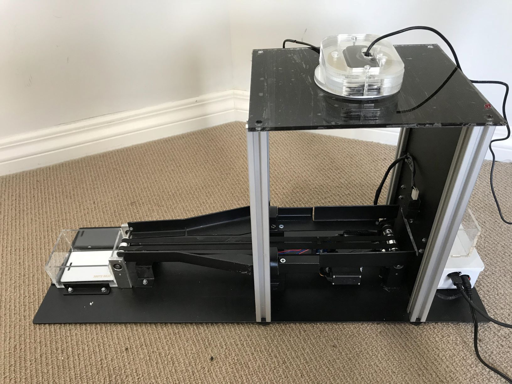
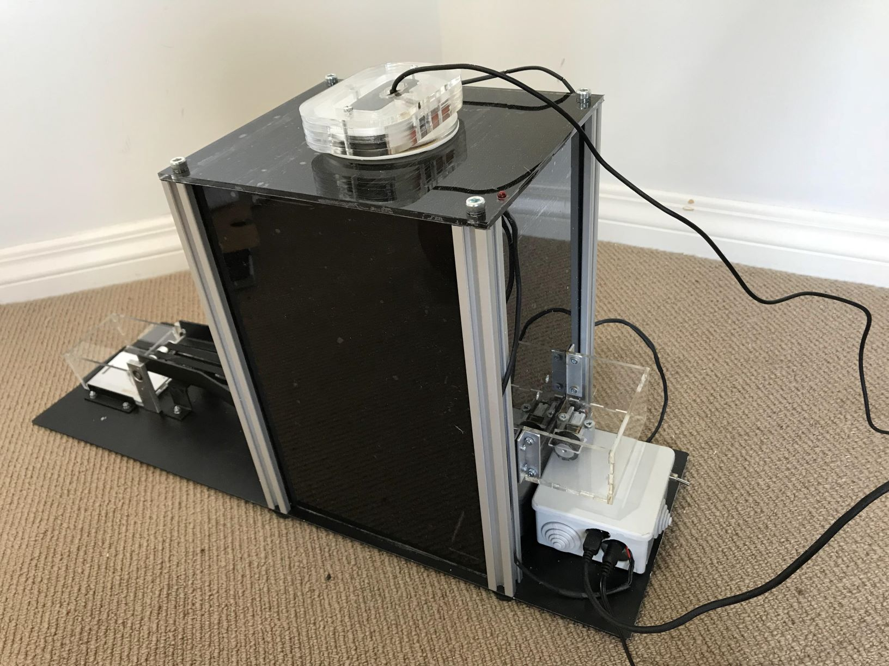
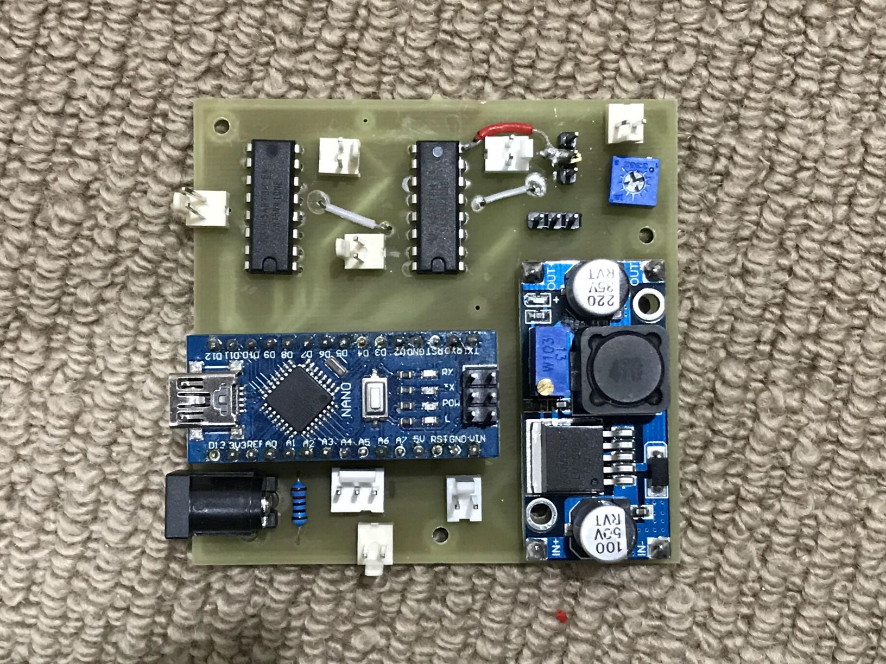
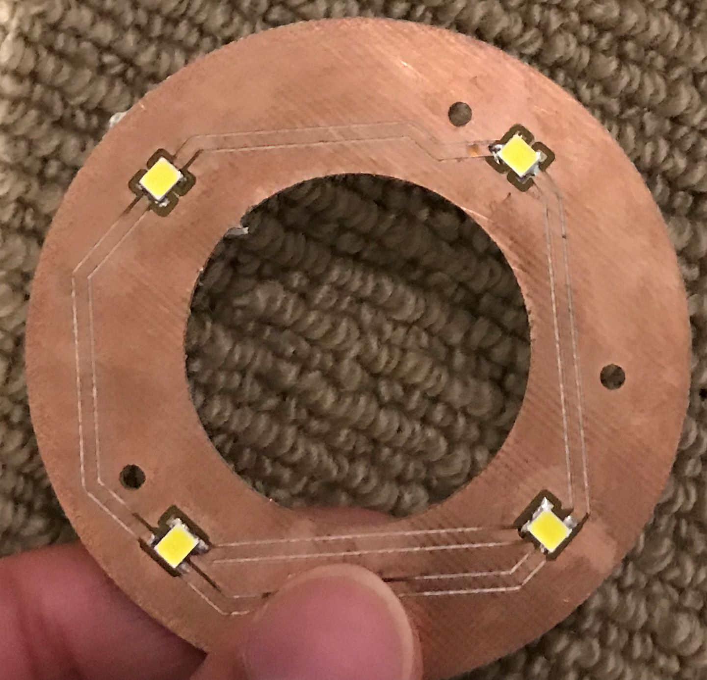
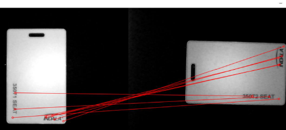

# README
In this README file I have briefly talked about major points in this project. The code is commited and I have added photos of the final product. 

## Introduction
The aim of this project is to design and build a system that receives a stack of RFID cards to be re-oriented to a provided reference orientation when necessary. The system should work by receiving instruction from a feedback control system to perform orientation correction automatically. The system also considers a feed system from an input stack to an output stack with the cards at the correct orientation. 

## Design Requirement
* Cards feed system from input stack to output stack.
* Decision making using machine vision.

## Design Process
### Mechanical Desing
Different designs were considered, such as a robot arm and card sliding path. The card sliding concept seemed the most efficient, however it was rejected as it require more frequent maintenance and low humidity environment. This is because humidity will result in higher friction on the sliders and may slow or stop the card moving down the slider.
The final desing uses a conveyer belt to move the card from the input stack via a feeder to the output stack. For the re-orientation part two solenoids and two servos were used. Below some photos of the final desgin.

### Electical and Electronic Desing
Since the system uses machine vision a sufficient amount of lighting is required for every processed frame. A PCB of LED ring was made for that purpose. Another PCB was made to hold the microcontroller and all other required electronics, mounts and connectors. Below photos of the PCBs.

### Software Design
The machine vision algorithm was built on Visual Studio using OpenCV C++ library and machine learning algorithm. Mainly the image is compared with a reference image through feature detection and feature matching algorithm and then matrix transformation is applied to make a decision on re-orienting the card. In order to apply the required actuation an Arduino Nano was made to communicate with Visual Studio via Serial Port. In terms of hardware, Arduino IDE was used to programm the Arduino nano to apply the required actuation depending on Visual Studio decisions.
Visual Studio code files:
* main.cpp >> machine vision code and decision making.
* stdafx.cpp , stdafx.h , targetver.h >> used for serial communication.

## Conclusion
The system used machine vision and matrix transformation to make decisions to correct the cards orientation by comparing a captured image to a referunce image. In terms of performance, the machine accuracy was about 81%. I believe adjusting some of the maching learning model parameters can enhace the performance greatly.
